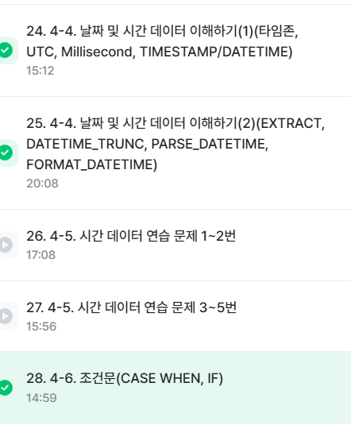
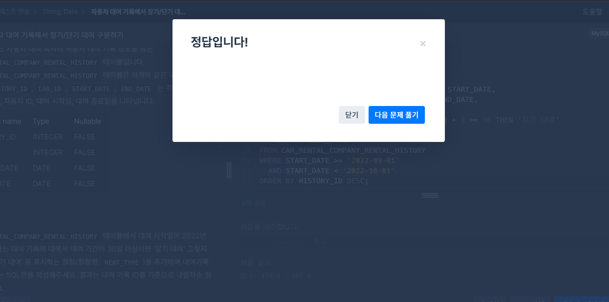
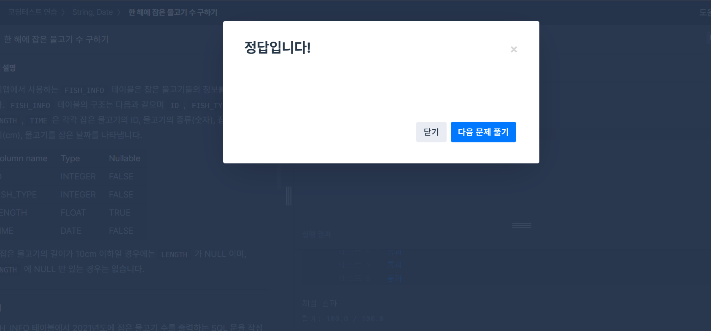
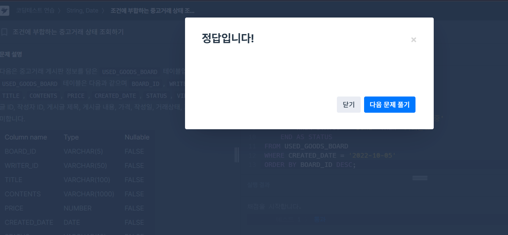
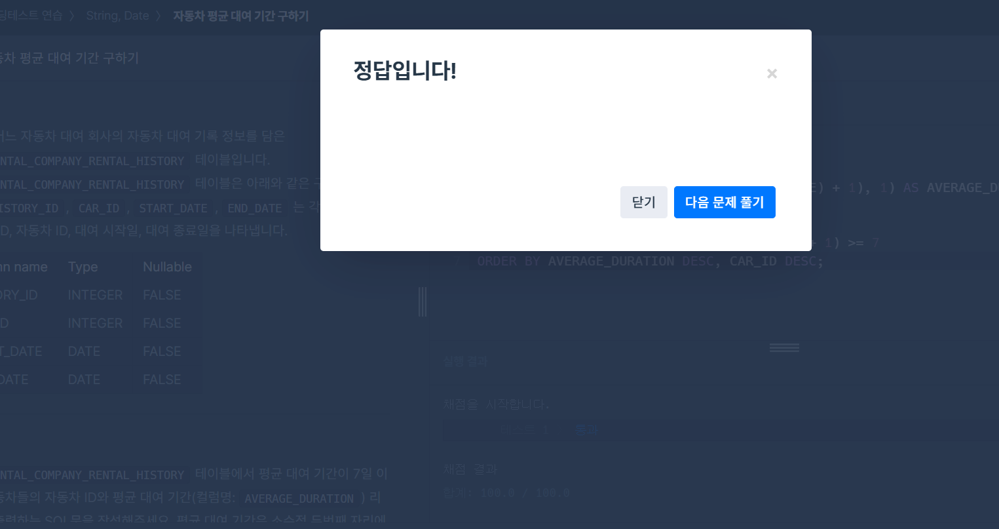

# 📘 SQL_BASIC 5주차 정규 과제

SQL_BASIC 정규 과제는 매주 정해진 분량의 `초보자를 위한 BigQuery(SQL) 입문` 강의를 듣고, 핵심 개념을 정리한 뒤 간단한 SQL 문제를 직접 풀어보는 방식으로 진행합니다.

이번 주는 날짜/시간 데이터와 조건문을 학습합니다. 특히 `CASE WHEN`은 SQL 문제 풀이와 데이터 분석에서 자주 사용되므로, 직접 분류 기준을 만들고 결과를 확인하는 연습을 해주세요.

완성된 과제는 Github에 업로드하고, 링크를 스프레드시트 'SQL' 시트에 입력해 제출해주세요.

**👀 수행 인증란은 필수입니다.**

---

## 📚 SQL_BASIC_5th_TIL

### 섹션 5. 데이터 탐색 - 변환

### 4-4. 날짜 및 시간 데이터 이해하기

### 4-6. 조건문(CASE WHEN, IF)

---

## ✨ 선택 강의

- 4-5. 시간 데이터 연습문제: 날짜/시간 함수를 더 연습하고 싶을 때 선택 수강
- 4-7. 조건문 연습문제: CASE WHEN과 IF를 더 연습하고 싶을 때 선택 수강

---

## 🏁 전체 강의 수강 계획

| 주차 | 필수 강의 범위 | 선택 강의 | 완료 여부 |
| --- | --- | --- | --- |
| 1주차 | 1-1 ~ 2-1 | 1 | ✅ |
| 2주차 | 2-2 ~ 2-3 | 2-4 | ✅ |
| 3주차 | 2-5, 2-7 ~ 2-8 | 2-6 | ✅ |
| 4주차 | 3-2 ~ 4-3 | 3-4 | ✅ |
| 5주차 | 4-4 ~ 4-6 | 4-5, 4-7 | ✅ |
| 6주차 | 5-2 ~ 5-5 | 5-6 | 🍽️ |
| 7주차 | 필수 강의 없음 | 6-2, 6-3, 6-4, 6-5 | 🍽️ |

---

<br>

<!-- 여기까진 그대로 둬 주세요-->

---

# 1️⃣ 개념 정리

아래 키워드 중 중요하다고 생각한 개념을 2개 이상 골라 짧게 정리해주세요. 3개보다 더 많이 정리하고 싶다면 자유롭게 항목을 추가해도 좋습니다.

이번 주 키워드:
- DATE
- DATETIME
- TIMESTAMP
- EXTRACT
- DATETIME_TRUNC
- FORMAT_DATETIME
- CASE WHEN
- IF

## 01.

```
개념 이름: DATE, DATETIME, TIMESTAMP

개념 설명:
시간 데이터는 DATE, DATETIME, TIMESTAMP 등으로 구분할 수 있다.
DATE는 날짜만 나타내는 데이터 타입이고, DATETIME은 날짜와 시간을 함께 나타내지만 Time Zone 정보는 포함하지 않는다.
TIMESTAMP는 특정 시점을 나타내는 값으로 UTC를 기준으로 하며 Time Zone과 함께 다룰 수 있다.
예를 들어 TIMESTAMP를 Asia/Seoul 기준의 DATETIME으로 변환하면 한국 시간으로 확인할 수 있다.

예시 쿼리:
SELECT
  CURRENT_DATE() AS current_date,
  CURRENT_DATE("Asia/Seoul") AS asia_date,
  CURRENT_DATETIME() AS current_datetime,
  CURRENT_DATETIME("Asia/Seoul") AS current_datetime_asia;
```

## 02.

```
개념 이름: EXTRACT, DATETIME_TRUNC, FORMAT_DATETIME

개념 설명:
EXTRACT는 DATETIME에서 연도, 월, 일, 시, 분, 요일 등 특정 부분만 추출할 때 사용한다.
DATETIME_TRUNC는 DATETIME 값을 특정 단위까지만 남기고 나머지를 잘라낼 때 사용한다.
FORMAT_DATETIME은 DATETIME 타입 데이터를 원하는 형식의 문자열 데이터로 변환할 때 사용한다.
반대로 문자열을 DATETIME으로 변환할 때는 PARSE_DATETIME을 사용할 수 있다.

예시 쿼리:
SELECT
  EXTRACT(YEAR FROM DATETIME "2024-01-02 14:00:00") AS year,
  EXTRACT(MONTH FROM DATETIME "2024-01-02 14:00:00") AS month,
  DATETIME_TRUNC(DATETIME "2024-01-02 14:42:13", HOUR) AS truncated_hour,
  FORMAT_DATETIME("%c", DATETIME "2024-01-11 12:35:35") AS formatted;
```

## (선택) 03.

```
개념 이름: CASE WHEN과 IF

개념 설명:
CASE WHEN은 여러 조건에 따라 서로 다른 결과를 반환하고 싶을 때 유용하다.
조건을 순서대로 확인한 뒤 참인 조건의 결과를 반환하고, 어떤 조건에도 해당하지 않으면 ELSE의 결과를 반환한다.
IF는 단일 조건일 때 간단하게 사용할 수 있으며, 조건이 참일 때의 값과 거짓일 때의 값을 각각 지정한다.

헷갈린 점:
CASE WHEN은 여러 조건을 처리할 때 적합하고, IF는 하나의 조건을 참과 거짓으로 나눌 때 적합하다는 차이를 구분해서 사용하는 점이 중요했다.
```

---

# 2️⃣ 수행 인증란

아래 중 하나 이상을 첨부해주세요.

- 강의 수강 화면 캡처
- 문제 풀이 정답 화면 캡처
- SQL 실행 결과 화면 캡처



---

# 3️⃣ 확인 문제

프로그래머스는 로그인이 필요하므로, 로그인 후 문제 풀이를 진행해주세요.

## 🧩 문제 1

문제 링크: [자동차 대여 기록에서 장기/단기 대여 구분하기](https://school.programmers.co.kr/learn/courses/30/lessons/151138)

풀이 과정:

```
- 장기/단기 대여를 나눈 기준: 대여 기간이 30일 이상이면 '장기 대여', 그렇지 않으면 '단기 대여'
- 사용한 날짜 계산 방식: DATEDIFF(END_DATE, START_DATE) + 1로 시작일과 종료일을 포함한 대여 기간을 계산
- CASE WHEN으로 만든 컬럼: RENT_TYPE
```



## 🧩 문제 2

문제 링크: [한 해에 잡은 물고기 수 구하기](https://school.programmers.co.kr/learn/courses/30/lessons/298516)

풀이 과정:

```
- 문제에서 요구한 연도: 2021년
- 사용한 날짜 조건: YEAR(TIME) = 2021
- 집계한 대상: 2021년에 잡힌 물고기 행의 개수를 COUNT(*)로 집계
```



## 🧩 문제 3

문제 링크: [조건에 부합하는 중고거래 상태 조회하기](https://school.programmers.co.kr/learn/courses/30/lessons/164672)

풀이 과정:

```
- 날짜 조건: CREATED_DATE가 2022-10-05인 게시글만 조회
- CASE WHEN으로 바꾼 값: SALE은 '판매중', RESERVED는 '예약중', DONE은 '거래완료'로 변경
- ELSE에 해당하는 경우: 문제에서 제시된 STATUS 값이 SALE, RESERVED, DONE으로 정해져 있어 별도의 ELSE는 사용하지 않았다.
- 정렬 기준: BOARD_ID 기준 내림차순
```



## 🧩 문제 4

문제 링크: [자동차 평균 대여 기간 구하기](https://school.programmers.co.kr/learn/courses/30/lessons/157342)

풀이 과정:

```
- GROUP BY 기준: CAR_ID
- 평균을 계산한 방식: DATEDIFF(END_DATE, START_DATE) + 1로 각 대여 기간을 계산한 뒤 AVG를 사용해 자동차별 평균 대여 기간을 구하고, ROUND(..., 1)로 소수점 첫째 자리까지 반올림
- HAVING에 사용한 조건: 평균 대여 기간이 7일 이상인 자동차만 조회하도록 AVG(DATEDIFF(END_DATE, START_DATE) + 1) >= 7 조건을 사용
- 처음 헷갈렸던 점: 대여 기간을 계산할 때 시작일과 종료일을 모두 포함하기 위해 DATEDIFF 결과에 1을 더해야 한다는 점
```



---

# 4️⃣ 이번 주 회고

```
1. 날짜 함수 중 가장 헷갈린 함수:
DATETIME_TRUNC와 FORMAT_DATETIME의 역할 차이가 처음에는 헷갈렸다. DATETIME_TRUNC는 시간 값을 특정 단위까지만 남기는 함수이고, FORMAT_DATETIME은 DATETIME을 원하는 형식의 문자열로 변환하는 함수라는 점을 구분하게 되었다.

2. CASE WHEN을 사용할 때 기억해야 할 문법:
CASE로 시작해서 WHEN 조건 THEN 결과를 작성하고, 필요하면 여러 WHEN을 이어서 사용한 뒤 ELSE를 작성하고 END로 끝내야 한다는 점을 기억해야 한다.

3. 날짜/시간 데이터나 조건문을 활용해보고 싶은 분석 상황:
날짜 데이터를 연도나 월별로 나누어 집계하거나, 특정 조건에 따라 사용자를 여러 그룹으로 분류하는 분석에서 활용해보고 싶다.
```

수고하셨습니다!